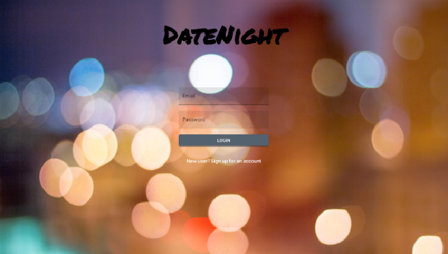
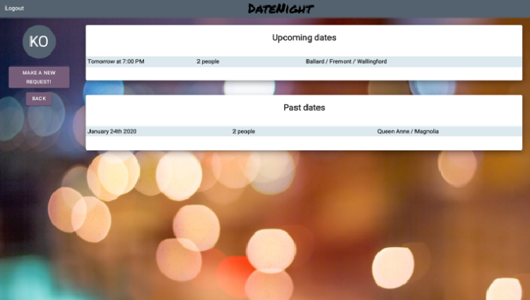
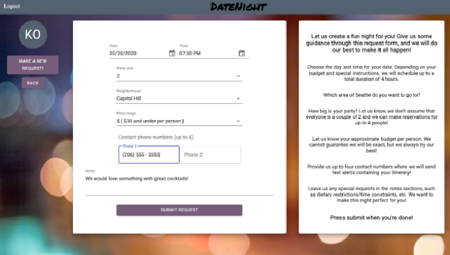
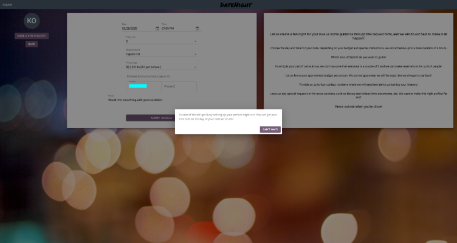
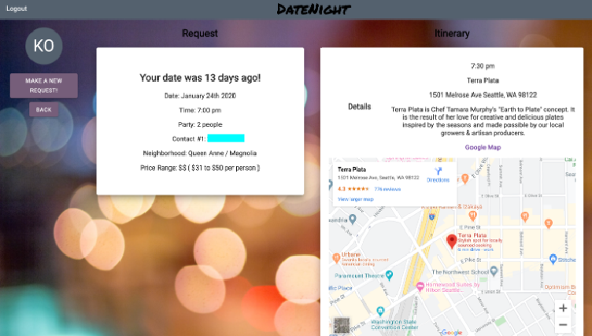
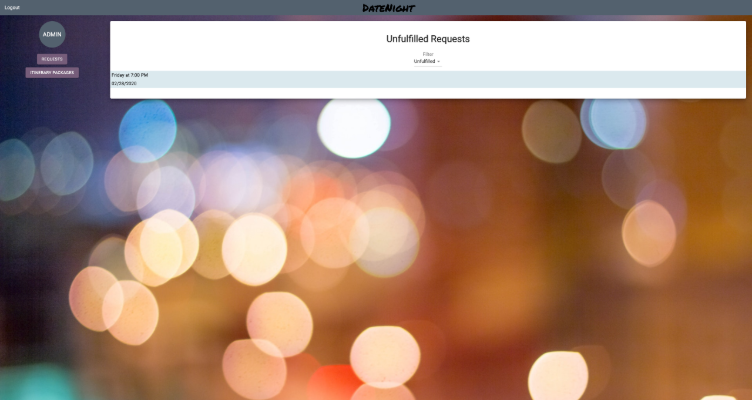
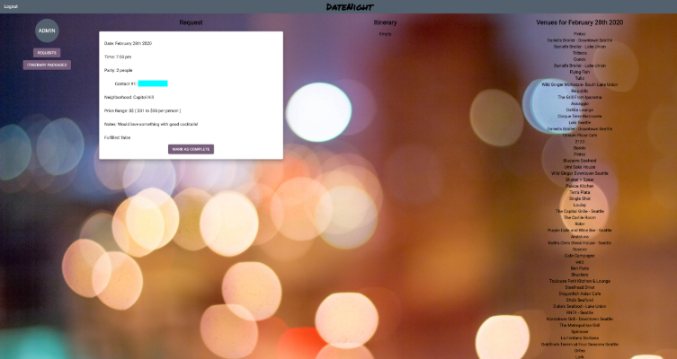
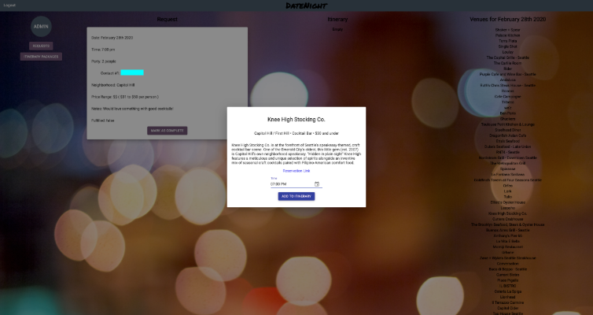
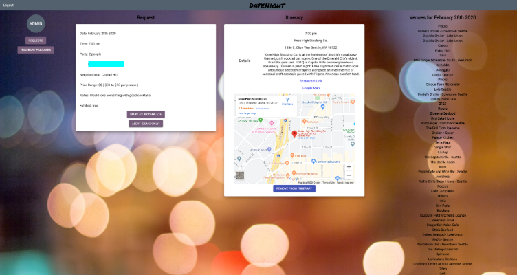

# DateNight - Front End

DateNight is a single-page web-based application designed for couples/partners who are looking for spontaneity when going out. 

This is my final project completed during Module Five at Flatiron School.  It is a single page web application built with a ReactJS front end and a [Rails API backend](https://github.com/kara-o/DateNight-backend).  The app is designed with separate user and admin interfaces.

## Built With

- ReactJS
- Create-React-App
- Devise Token Auth
- Google Maps API
- Twilio API
- Material UI/custom CSS
- Nokogiri for scraping HTML from OpenTable

## How to Run

Please install my [Rails API back end](https://github.com/kara-o/DateNight-backend) as well.

In your terminal navigate to the directory where you want to save the front end files, then enter and run each step:

1. `git git@github.com:kara-o/DateNight-frontend.git`
1. `cd frontend-datenight`
1. `npm install`
1. `npm start`

## Goals

- Currently working on Redux integration!
- Further developing Admin interface to make reservation booking more streamlined
- Add different types of venues, other than places to eat?

## Screenshots

<h3 align="center">User Interface</h3>

 
<em>Login</em>

 
<em>Home</em>

 
<em>Make a new request</em>

 
<em>Request made successfully</em>

 
<em>Example of itinerary from a past date</em>

<h3 align="center">Admin Interface</h3>

 
<em>Login</em>

 
<em>Home</em>

 
<em>Unfulfilled request</em>

 
<em>Selecting itinerary</em>

 
<em>Fulfilled request</em>

